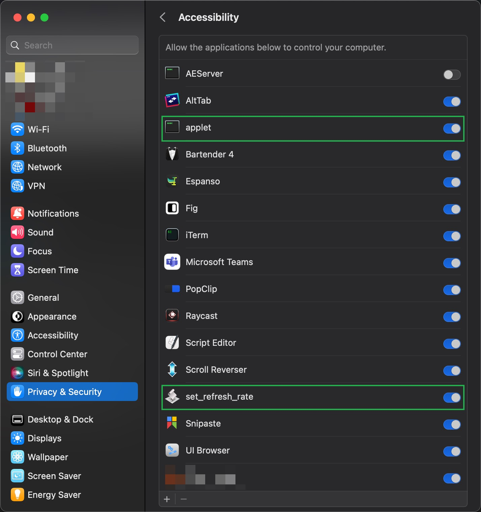
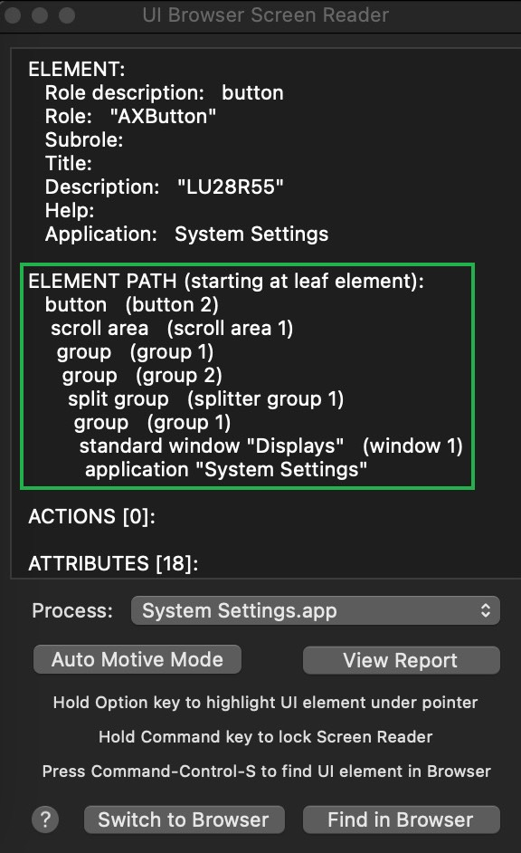

#### AppleScript to Correct macOS Ventura Variable Refresh Rate Issue

Issue: https://forums.macrumors.com/threads/variable-refresh-rate-freesync-gsync-flicker.2320463/?post=30551784

Flickering with screens that support variable refresh rate is a very common issue in Monterey and Ventura. 

Here is the script that sets the refresh rate back to 60Hz:

```
do shell script "open x-apple.systempreferences:com.apple.Displays-Settings.extension"
tell application "System Events"
	tell application process "System Settings"
		delay 2
		tell group 1 of group 2 of splitter group 1 of group 1 of window 1
			tell scroll area 1
				keystroke tab
				delay 0.5
				keystroke tab
				delay 0.5
				keystroke tab
				delay 0.5
				keystroke space
				delay 1
			end tell
			click pop up button 1 of group 3 of scroll area 2
			delay 0.5
			tell pop up button 1 of group 3 of scroll area 2
				click menu item 3 of menu 1
			end tell
		end tell
	end tell
end tell
```

Save it as ```set_refresh_rate.scpt```. Run ```osacompile -o set_refresh_rate.app set_refresh_rate.scpt```. Use underscore instead of hyphen or space in the filename.

Run the ```set_refresh_rate.app``` once, then toggle on ```applet``` and ```set_refresh_rate``` in the Accessibility settings of Privacy & Security.



UI Browser Screen Reader was used to determine ```ELEMENT PATH``` in the script.

